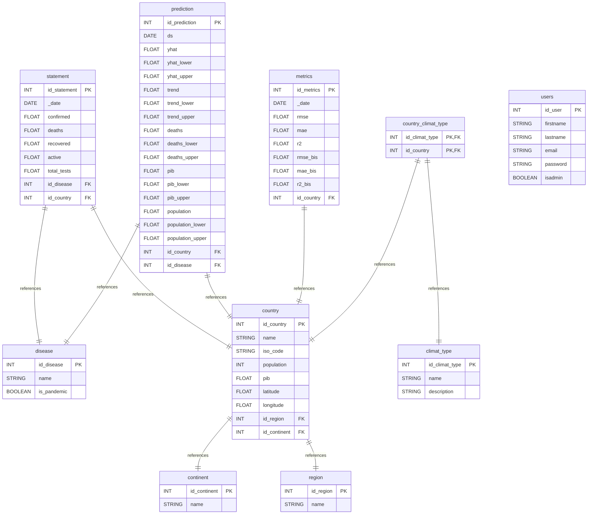

# Base de Données - MSPR-TPRE-601

## 📋 Vue d'ensemble

La base de données MSPR-TPRE-601 est conçue pour gérer des données épidémiologiques avec des capacités d'analyse prédictive et de reporting. Elle utilise PostgreSQL comme SGBD principal.

## 🗄️ Configuration PostgreSQL

### Paramètres de Connexion
- **SGBD** : PostgreSQL
- **Base de données** : `mspr502`
- **Utilisateur** : `mspr502`
- **Mot de passe** : `s5t4v5`
- **Ports** : 
  - France : 5431
  - Suisse : 5432 (interne)
  - États-Unis : 5433

### Health Check
```yaml
healthcheck:
  test: ["CMD-SHELL", "pg_isready -U mspr502"]
  interval: 10s
  timeout: 5s
  retries: 5
```

## 📊 Modèle Conceptuel de Données (MCD)

### Schéma Entité-Relation



## 📋 Description des Tables

### 1. Table `disease`
**Description** : Catalogue des maladies et épidémies
- `id_disease` (PK) : Identifiant unique de la maladie
- `name` : Nom de la maladie
- `is_pandemic` : Indicateur si la maladie est une pandémie

### 2. Table `statement`
**Description** : Données épidémiologiques quotidiennes
- `id_statement` (PK) : Identifiant unique du relevé
- `_date` : Date du relevé
- `confirmed` : Nombre de cas confirmés
- `deaths` : Nombre de décès
- `recovered` : Nombre de guérisons
- `active` : Nombre de cas actifs
- `total_tests` : Nombre total de tests
- `id_disease` (FK) : Référence vers la maladie
- `id_country` (FK) : Référence vers le pays

### 3. Table `prediction`
**Description** : Prédictions générées par les modèles ML
- `id_prediction` (PK) : Identifiant unique de la prédiction
- `ds` : Date de la prédiction
- `yhat` : Valeur prédite principale
- `yhat_lower` : Borne inférieure de l'intervalle de confiance
- `yhat_upper` : Borne supérieure de l'intervalle de confiance
- `trend` : Tendance prédite
- `trend_lower` : Borne inférieure de la tendance
- `trend_upper` : Borne supérieure de la tendance
- `deaths` : Prédiction des décès
- `deaths_lower` : Borne inférieure des décès
- `deaths_upper` : Borne supérieure des décès
- `pib` : Prédiction du PIB
- `pib_lower` : Borne inférieure du PIB
- `pib_upper` : Borne supérieure du PIB
- `population` : Prédiction de la population
- `population_lower` : Borne inférieure de la population
- `population_upper` : Borne supérieure de la population
- `id_country` (FK) : Référence vers le pays
- `id_disease` (FK) : Référence vers la maladie

### 4. Table `metrics`
**Description** : Métriques de performance des modèles
- `id_metrics` (PK) : Identifiant unique des métriques
- `_date` : Date de calcul des métriques
- `rmse` : Root Mean Square Error
- `mae` : Mean Absolute Error
- `r2` : Coefficient de détermination
- `rmse_bis` : RMSE secondaire
- `mae_bis` : MAE secondaire
- `r2_bis` : R² secondaire
- `id_country` (FK) : Référence vers le pays

### 5. Table `country`
**Description** : Informations géographiques et démographiques des pays
- `id_country` (PK) : Identifiant unique du pays
- `name` : Nom du pays
- `iso_code` : Code ISO du pays
- `population` : Population du pays
- `pib` : Produit Intérieur Brut
- `latitude` : Latitude géographique
- `longitude` : Longitude géographique
- `id_region` (FK) : Référence vers la région
- `id_continent` (FK) : Référence vers le continent

### 6. Table `continent`
**Description** : Continents géographiques
- `id_continent` (PK) : Identifiant unique du continent
- `name` : Nom du continent

### 7. Table `region`
**Description** : Régions géographiques
- `id_region` (PK) : Identifiant unique de la région
- `name` : Nom de la région

### 8. Table `climat_type`
**Description** : Types de climat
- `id_climat_type` (PK) : Identifiant unique du type de climat
- `name` : Nom du type de climat
- `description` : Description du climat

### 9. Table `country_climat_type`
**Description** : Relation many-to-many entre pays et types de climat
- `id_climat_type` (PK, FK) : Référence vers le type de climat
- `id_country` (PK, FK) : Référence vers le pays

### 10. Table `users`
**Description** : Utilisateurs du système
- `id_user` (PK) : Identifiant unique de l'utilisateur
- `firstname` : Prénom
- `lastname` : Nom de famille
- `email` : Adresse email
- `password` : Mot de passe hashé
- `isadmin` : Indicateur d'administrateur

## 🔍 Requêtes Utiles

### Requêtes de Base
```sql
-- Nombre de cas confirmés par pays
SELECT c.name, SUM(s.confirmed) as total_confirmed
FROM statement s
JOIN country c ON s.id_country = c.id_country
GROUP BY c.name
ORDER BY total_confirmed DESC;

-- Prédictions pour un pays spécifique
SELECT p.ds, p.yhat, p.yhat_lower, p.yhat_upper
FROM prediction p
JOIN country c ON p.id_country = c.id_country
WHERE c.name = 'France'
ORDER BY p.ds;

-- Performance des modèles
SELECT c.name, m.rmse, m.mae, m.r2
FROM metrics m
JOIN country c ON m.id_country = c.id_country
ORDER BY m.rmse;
```

### Requêtes Analytiques
```sql
-- Évolution des cas par mois
SELECT 
    DATE_TRUNC('month', s._date) as month,
    SUM(s.confirmed) as total_confirmed,
    SUM(s.deaths) as total_deaths
FROM statement s
GROUP BY DATE_TRUNC('month', s._date)
ORDER BY month;

-- Comparaison prédictions vs réalité
SELECT 
    s._date,
    s.confirmed as real_confirmed,
    p.yhat as predicted_confirmed
FROM statement s
JOIN prediction p ON s.id_country = p.id_country 
    AND s._date = p.ds
WHERE s.id_country = 1
ORDER BY s._date;
```

## 🔧 Administration

### Connexion PgAdmin
- **URL** : http://localhost:7081 (FR), 7082 (CH), 7083 (US)
- **Email** : admin@admin.com
- **Mot de passe** : s5t4v5

### Commandes PostgreSQL Utiles
```sql
-- Vérifier la taille de la base
SELECT pg_size_pretty(pg_database_size('mspr502'));

-- Lister les tables
\dt

-- Vérifier les connexions actives
SELECT * FROM pg_stat_activity;

-- Vérifier l'espace disque
SELECT schemaname, tablename, pg_size_pretty(pg_total_relation_size(schemaname||'.'||tablename)) as size
FROM pg_tables
ORDER BY pg_total_relation_size(schemaname||'.'||tablename) DESC;
```

## 📊 Métriques de Performance

### Indicateurs Clés
- **Taille de la base** : Variable selon les données
- **Nombre de tables** : 10 tables principales
- **Index** : Index automatiques sur les clés primaires
- **Contraintes** : Clés étrangères pour l'intégrité référentielle

### Optimisations Recommandées
```sql
-- Index sur les dates pour améliorer les performances
CREATE INDEX idx_statement_date ON statement(_date);
CREATE INDEX idx_prediction_date ON prediction(ds);

-- Index sur les jointures fréquentes
CREATE INDEX idx_statement_country ON statement(id_country);
CREATE INDEX idx_prediction_country ON prediction(id_country);
```

## 🔄 Maintenance

### Sauvegarde
```bash
# Sauvegarde complète
docker exec mspr601_postgres_fr pg_dump -U mspr502 mspr502 > backup.sql

# Restauration
docker exec -i mspr601_postgres_fr psql -U mspr502 mspr502 < backup.sql
```

### Nettoyage
```sql
-- Nettoyer les anciennes données
DELETE FROM statement WHERE _date < CURRENT_DATE - INTERVAL '1 year';
DELETE FROM prediction WHERE ds < CURRENT_DATE - INTERVAL '6 months';
```

### Monitoring
```sql
-- Vérifier l'état des tables
SELECT schemaname, tablename, n_tup_ins, n_tup_upd, n_tup_del
FROM pg_stat_user_tables
ORDER BY n_tup_ins DESC;
``` 