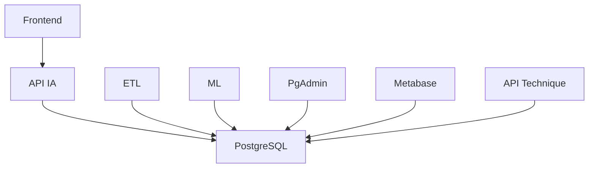

# Services - MSPR-TPRE-601

## 📋 Vue d'ensemble des Services

Ce document détaille tous les services disponibles dans l'architecture MSPR-TPRE-601, leurs configurations, et leurs interactions.

## 🎨 Frontend Service

### Description
Interface utilisateur Vue.js servie par Nginx pour une performance optimale.

### Configuration
- **Image de base** : `node:20-alpine`
- **Serveur de production** : `nginx:stable-alpine`
- **Ports** : 5001 (FR), 5002 (CH), 5003 (US)
- **Repository** : `https://github.com/Enzobu/MSPR-TPRE-601-FRONT.git`

### Architecture Multi-Stage
```dockerfile
# Stage 1: Base avec dépendances
FROM node:20-alpine AS base
# Installation et configuration

# Stage 2: Tests de qualité
FROM base AS test
CMD ["npm", "run", "quality"]

# Stage 3: Build de production
FROM base AS build
RUN npm run build

# Stage 4: Serveur Nginx
FROM nginx:stable-alpine
COPY --from=build /app/dist /usr/share/nginx/html
```

### Variables d'Environnement
- `VITE_API_URL` : URL de l'API backend
- `VITE_APP_TITLE` : Titre de l'application

### Fonctionnalités
- Interface utilisateur responsive
- Tests de qualité automatisés
- Build optimisé pour la production
- Servi par Nginx pour les performances

## 🔌 API IA Service

### Description
API REST Flask pour l'intelligence artificielle et la gestion des données.

### Configuration
- **Image de base** : `python:3.11-slim`
- **Framework** : Flask 3.0.3
- **Ports** : 6001 (FR), 6002 (CH), 6003 (US)
- **Repository** : `https://github.com/Enzobu/MSPR-TPRE-601-API.git`

### Dépendances Python
```txt
Flask==3.0.3
flask-restx==1.3.0
Flask-CORS==4.0.1
flask_jwt_extended==4.7.1
bcrypt==4.2.0
psycopg2-binary==2.9.7
gunicorn==21.2.0
```

### Fonctionnalités
- API REST avec Flask-RESTX
- Authentification JWT
- CORS configuré
- Tests automatisés (pytest)
- Connexion PostgreSQL
- Documentation automatique

### Endpoints Principaux
- `/api/v1/` : API principale
- `/health` : Health check
- `/docs` : Documentation Swagger

## 🤖 ML Service

### Description
Services de Machine Learning avec Apache Spark pour l'analyse prédictive.

### Configuration
- **Image de base** : `python:3.10-slim`
- **Moteur** : Apache Spark 3.4.4
- **Repository** : `https://github.com/Enzobu/MSPR-TPRE-601-ML.git`

### Dépendances Python
```txt
matplotlib
pandas
prophet
pystan
plotly
joblib
scikit-learn
numpy
psycopg2-binary
```

### Fonctionnalités
- Analyse prédictive avec Prophet
- Visualisation avec Plotly
- Intégration Spark pour le big data
- Connexion PostgreSQL
- Modèles de ML avec scikit-learn

### Outils Inclus
- Apache Spark 3.4.4
- Driver PostgreSQL JDBC
- Scripts d'analyse prédictive
- Environnement de développement

## 🔄 ETL Service

### Description
Pipeline Extract, Transform, Load avec Apache Spark pour le traitement des données.

### Configuration
- **Image de base** : `python:3.10-slim`
- **Moteur** : Apache Spark 3.4.4
- **Fonction** : Traitement et chargement de données

### Fonctionnalités
- Extraction de données depuis sources externes
- Transformation avec Spark
- Chargement vers PostgreSQL
- Traitement de gros volumes
- Pipeline automatisé

### Processus ETL
1. **Extract** : Récupération des données sources
2. **Transform** : Nettoyage et transformation
3. **Load** : Chargement en base PostgreSQL

## 🗄️ PostgreSQL Service

### Description
Base de données relationnelle PostgreSQL pour le stockage des données.

### Configuration
- **Image** : Custom PostgreSQL
- **Ports** : 5431 (FR), 5432 (CH), 5433 (US)
- **Base de données** : `mspr502`
- **Utilisateur** : `mspr502`
- **Mot de passe** : `s5t4v5`

### Health Check
```yaml
healthcheck:
  test: ["CMD-SHELL", "pg_isready -U mspr502"]
  interval: 10s
  timeout: 5s
  retries: 5
```

### Fonctionnalités
- Base de données épidémiologique
- Schéma optimisé pour les analyses
- Health checks automatisés
- Persistance des données
- Connexions sécurisées

## 🛠️ PgAdmin Service

### Description
Interface d'administration web pour PostgreSQL.

### Configuration
- **Image** : Custom PgAdmin
- **Ports** : 7081 (FR), 7082 (CH), 7083 (US)
- **Email** : `admin@admin.com`
- **Mot de passe** : `s5t4v5`

### Fonctionnalités
- Interface web d'administration
- Gestion des bases de données
- Exécution de requêtes SQL
- Monitoring des performances
- Gestion des utilisateurs

## 📊 Metabase Service (FR & US)

### Description
Plateforme de Business Intelligence pour la visualisation des données.

### Configuration
- **Image** : `metabase/metabase:v0.52.x`
- **Ports** : 3001 (FR), 3003 (US)
- **Base de données** : SQLite locale

### Fonctionnalités
- Tableaux de bord interactifs
- Requêtes visuelles
- Export de rapports
- Alertes automatisées
- Partage de dashboards

## 🔧 API Technique Service (US uniquement)

### Description
API technique spécifique au cluster États-Unis.

### Configuration
- **Image de base** : `python:3.11-slim`
- **Port** : 5000
- **Framework** : Flask

### Fonctionnalités
- API technique spécialisée
- Endpoints spécifiques US
- Intégration avec PostgreSQL
- Documentation technique

## 🔗 Communication Inter-Services

### Dépendances


### Variables d'Environnement Communes
```bash
# Base de données
DB_HOST=postgres_[cluster]
DB_USER=mspr502
DB_PASSWORD=s5t4v5
DB_DATABASE=mspr502
DB_PORT=5432

# Frontend
VITE_API_URL=http://api_[cluster]:5000
VITE_APP_TITLE=MSPR-601
```

## 📊 Monitoring des Services

### Health Checks
- **PostgreSQL** : `pg_isready`
- **API IA** : Endpoint `/health`
- **Frontend** : Serveur Nginx
- **Services** : Docker health checks

### Logs
```bash
# Voir les logs d'un service
docker logs -f mspr601_[service]_[cluster]

# Exemples
docker logs -f mspr601_front_fr
docker logs -f mspr601_api_ia_flask_fr
docker logs -f mspr601_postgres_fr
```

### Métriques
```bash
# Statistiques des conteneurs
docker stats

# Utilisation des ressources
docker system df
```

## 🔧 Configuration Avancée

### Ressources par Service
```yaml
# Exemple de configuration des ressources
services:
  api_ia_fr:
    deploy:
      resources:
        limits:
          memory: 1G
          cpus: '0.5'
        reservations:
          memory: 512M
          cpus: '0.25'
```

### Réseaux
- Chaque cluster utilise le réseau Docker par défaut
- Communication inter-services via noms de conteneurs
- Isolation complète entre clusters

### Volumes
- **PostgreSQL** : Persistance des données
- **Metabase** : Configuration et données
- **Logs** : Rotation automatique

## 🚀 Déploiement des Services

### Ordre de Démarrage
1. **PostgreSQL** (avec health check)
2. **Services dépendants** (API, ETL, ML)
3. **Services d'administration** (PgAdmin, Metabase)
4. **Frontend** (dernier)

### Commandes de Déploiement
```bash
# Déploiement complet
make up_[cluster]

# Déploiement d'un service spécifique
docker compose -f docker-compose.[cluster].yml up -d [service]

# Reconstruction
make build_[cluster]
```

## 🔍 Troubleshooting

### Problèmes Courants
1. **Connexion base de données** : Vérifier les variables d'environnement
2. **Ports en conflit** : Vérifier la disponibilité des ports
3. **Mémoire insuffisante** : Ajuster les limites Docker
4. **Dépendances manquantes** : Reconstruire les images

### Commandes de Diagnostic
```bash
# Statut des services
docker ps

# Logs en temps réel
docker logs -f [container_name]

# Shell dans un conteneur
docker exec -it [container_name] /bin/bash

# Vérification des réseaux
docker network ls
docker network inspect [network_name]
``` 